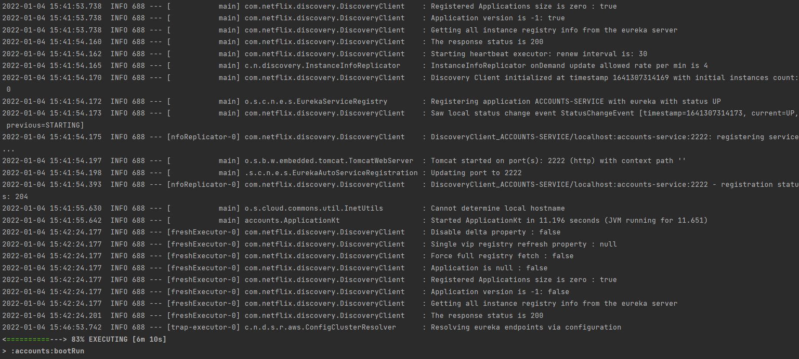
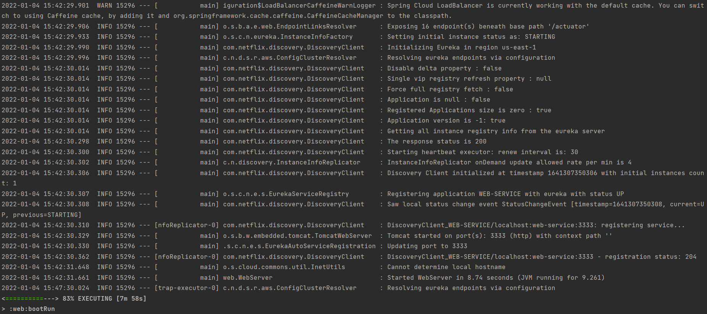
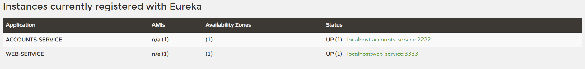
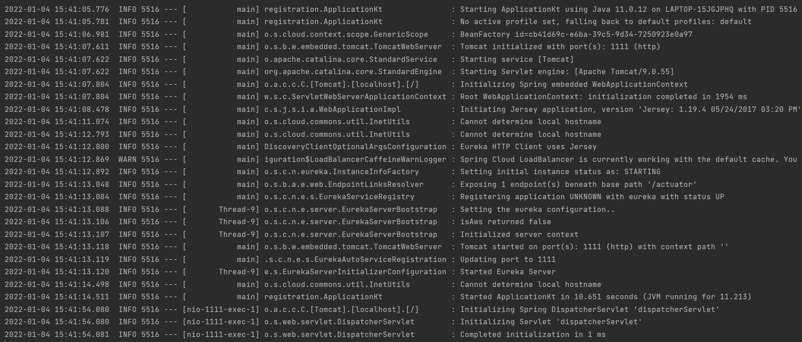
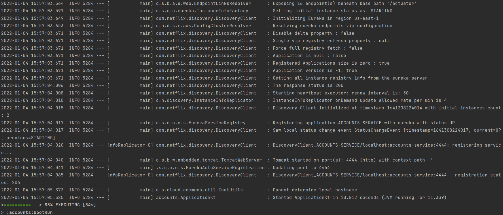
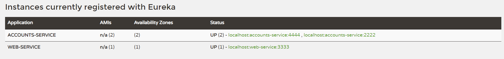
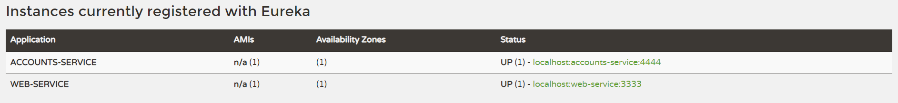
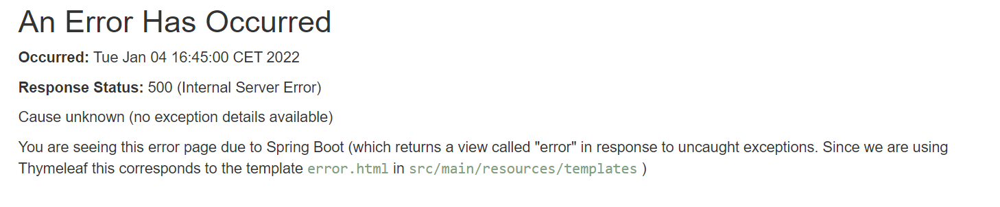
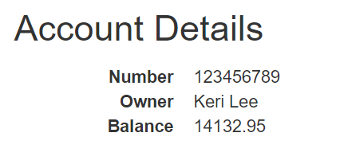

# Solution


## The two services accounts (2222) and web are running and registered

In order to register the services we must first run the Service Register by running the following command:
```
./gradlew :registration:bootRun
```

Once it is up, we can run both services which will register themselves in the Service Register:
```
./gradlew :accounts:bootRun
./gradlew :web:bootRun
```

Logs produced by accounts service to prove that it is registered correclty:



Logs produced by web service:



## The service registration service has these two services registered

We can see that the services have been successfully registered by checking the dashboard:



Or also by checking the logs generated by the Service Register:



## A second accounts service instance is started and will use the port 4444. This second accounts (4444) is also registered

In order to create another account service instance we must first change the port where it is executed by modifying
the *application.yml* file in the **accounts** project.

Once it is done, the service is ready to run another instance by just opening a new terminal and running the same
command as above.

Logs generated to prove it is running:



Two instances of **accounts** service registered in the dashboard:



## What happens when you kill the service accounts (2222) and do requests to web? Can the web service provide information about the accounts again? Why?

If we kill one of the account instances registered it will disappear from the dashboard:



If we try to do a request to the account service immediately it will return an internal server error (code 500), since
it tries to call de dead instance.



Anyway, after a few seconds the request will return the correct result again, since Eureka is able to find the second
instance running:

